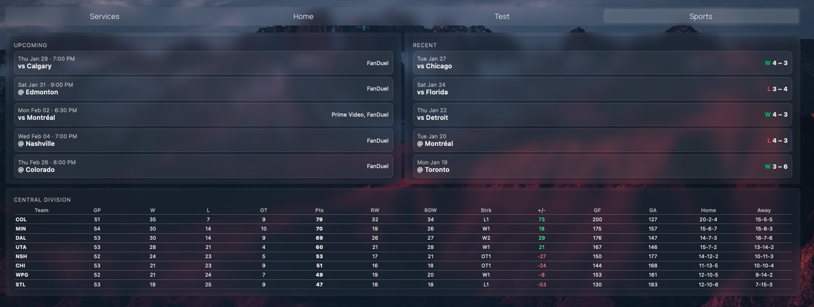
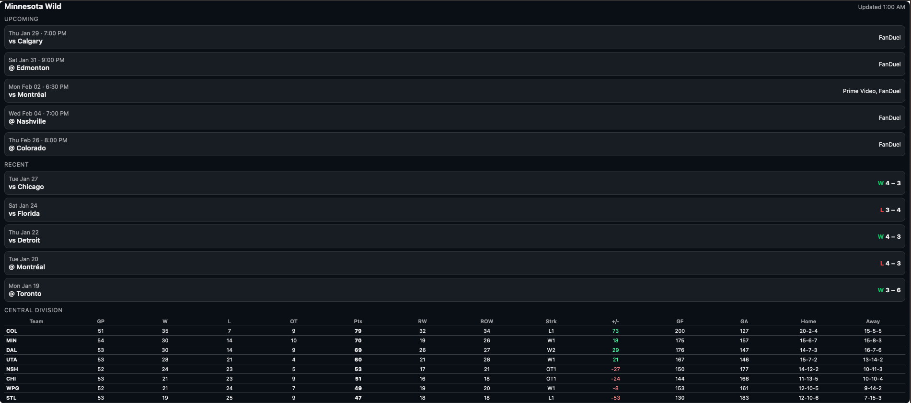

## Sports Widget
### Description
Python app to create sports widgets that can be used in webpages. My exact use was to create something that could be imbedded within my personal https://gethomepage.dev page. 





### Running
- I wrote this to work as a docker stack and I included a run.sh script for slightly better ease of use
- You can set a variety of defaults in the docker compose
	- TEAM_CODE: The abbreviated name of your desired NHL team
	- DEFAULT_DIVISION: Name of the NHL division you'd like to capture for your widget
	- CACHE_TTL_SECONDS: Number of seconds to cache results for upcoming and recent games
	- STANDINGS_CACHE_TTL_SECONDS: Number of seconds to cache results for standings
	- LIMIT_UPCOMING: The number of upcoming game results you want
	- LIMIT_RECENT: The number of recent game results you want

### Endpoints
- /health
	- Generic health endpoint that can be used for your docker stack
- /api
	- Returns a json body of the results
- /widget/hockey
	- Returns a widget
- /widget/hockey/upcoming
	- Returns a widget with just the upcoming games
- /widget/hockey/recent
	- Returns a widget with just the recent and live games
- /widget/hockey/standings
	- Returns a widget with just the standings for your desired division

### Endpoint Query Parameters
There are a few query parameters you can add to the end of each endpoint. 
Note: Parameters are only available with endpoints that would return the desired result. "standings" won't work with the "upcoming" or "recent" endpoints
- theme
	- Set the theme
- upcoming
	- Set the number of upcoming game results
- recent
	- Set the number of recent(and live) game results
- standings
	- Whether standings should be included
	- 1 or 0
- division
	- Override the division

### Widget Themes
There are 3 themes to pick from
- light
- dark
- transparent

### Endpoint example
Say you want a transparent theme, 5 upcoming games, 5 recent games, Central division and show the standings. Your url would look like this
`/widget/hockey?theme=transparent&upcoming=5&recent=5&division=central&standings=1`

Say you want just the standings with a transparent theme?
`/widget/hockey/standings?theme=transparent`

Upcoming with 5 results and a transparent theme?
`/widget/hockey/upcoming?theme=transparent&upcoming=5`

### Comments
- I wrote this with the intention of adding other sport teams and leagues as well. I personally wanted to add American Football as well
- I used ChatGPT to throw the bulk of it all together
	- The layout isn't exactly what I'd typically like to have, but it works
	- I did move some stuff around to create more reasonable classes together, but there are things like "handlers" and "model" classes that I think it could use
	- I don't have a ton of free time to do all of that, so maybe someday I'll get around to shoring that all up
- I am aware that I'm reusing an element ID for the iframes and I should use a class name...
- I'm very open to PRs, but I don't have a lot of free time, so feel free to fork it as well. Just let me know if you have something cool I should check out and incorporate it into mine. 


#### GetHomePage services.yaml example
```
- "Hockey Upcoming Games":
  - "":
      id: custom-iframe
      widget:
          type: iframe
          id: hockey-widget
          name: hockey
          classes: h-78
          src: http://{{HOMEPAGE_VAR_SERVER_IP_ADDRESS}}:8005/widget/hockey/upcoming?theme=transparent
          refreshInterval: 300000
          allowScrolling: no
          loadingStrategy: eager
- "Hockey Recent Games":
  - "":
      id: custom-iframe
      widget:
          type: iframe
          id: hockey-widget
          name: hockey
          classes: h-78
          src: http://{{HOMEPAGE_VAR_SERVER_IP_ADDRESS}}:8005/widget/hockey/recent?theme=transparent
          refreshInterval: 300000
          allowScrolling: no
          loadingStrategy: eager
- "Hockey Standings":
  - "":
      id: custom-iframe
      widget:
          type: iframe
          id: hockey-widget
          name: hockey
          classes: h-55
          src: http://{{HOMEPAGE_VAR_SERVER_IP_ADDRESS}}:8005/widget/hockey/standings?theme=transparent
          refreshInterval: 300000
          allowScrolling: no
          loadingStrategy: eager
```

#### GetHomePage settings.yaml example
```
layout:
  Hockey Upcoming Games:
    style: column
    tab: Sports
    header: false
  Hockey Recent Games:
    style: column
    tab: Sports
    header: false
  Hockey Standings:
    style: row
    tab: Sports
    header: false
```

#### GetHomePage custom.css example - Removes iframe title for a cleaner look
```
#custom-iframe > div > .service-title {
        display: none !important;
}
```
